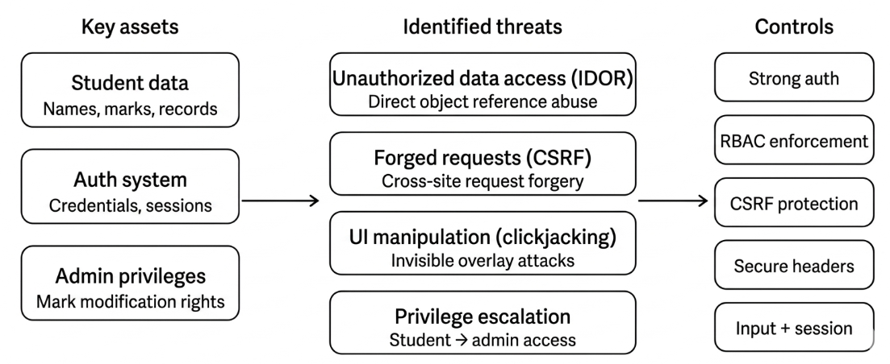

3. Protection Needs Elicitation (PNE)
Overview

# 3. Protection Needs Elicitation (PNE)

## 3.1 Introduction

Protection Needs Elicitation (PNE) is a systematic process used to identify and define the security requirements of a system. It focuses on determining what needs to be protected, the potential threats to those assets, and the controls required to mitigate those threats.

Unlike reactive security approaches, PNE ensures that security considerations are incorporated at the early stages of system design. This proactive approach establishes a strong security foundation and guides all subsequent development decisions.

---

## 3.2 Asset Identification

A comprehensive security analysis begins with identifying critical system assets. The following key assets were identified in the Student Result Portal:

### 🔹 Student Data
- Includes names, marks, and academic records  
- Highly sensitive and must be protected from unauthorized access and modification  

### 🔹 Authentication System
- Handles user credentials and session management  
- A compromise in this component can expose the entire system  

### 🔹 Administrative Privileges
- Allows modification of student records (e.g., updating marks)  
- Unauthorized access can lead to data manipulation and academic fraud  

---

## 3.3 Threat Identification

Based on the identified assets, the system was evaluated for potential threats using a structured approach:

### 🔸 Insecure Direct Object Reference (IDOR)
- Unauthorized users can access restricted data by modifying resource identifiers  
- Example: Changing a student ID in the URL to view another student's result  

### 🔸 Cross-Site Request Forgery (CSRF)
- Attackers trick authenticated users into performing unintended actions  
- Example: Submitting a request to modify marks without user consent  

### 🔸 Clickjacking
- The application can be embedded in a malicious iframe  
- Users may unknowingly interact with hidden UI elements  

### 🔸 Privilege Escalation
- Low-privileged users gain higher-level access  
- Example: A student performing administrative actions  

---

## 3.4 Security Requirements

Based on the identified threats, the following security requirements were established:

| Security Requirement | Description |
|--------------------|------------|
| **Authentication** | Strong user authentication mechanisms to prevent unauthorized access |
| **RBAC (Role-Based Access Control)** | Restrict access based on user roles (admin vs student) |
| **CSRF Protection** | Use of CSRF tokens for all state-changing operations |
| **Input Validation** | Prevent malicious input and data manipulation |
| **Session Security** | Ensure secure session handling and integrity |
| **Security Headers** | Protect against clickjacking and related attacks |

---

## 3.5 Conclusion

The PNE process provided a structured foundation for understanding the system's security requirements. By identifying critical assets, mapping them to potential threats, and defining appropriate controls, the project ensured a focused and effective security strategy.

These requirements served as guiding principles throughout the design and implementation phases, enabling the development of a secure and reliable application.

